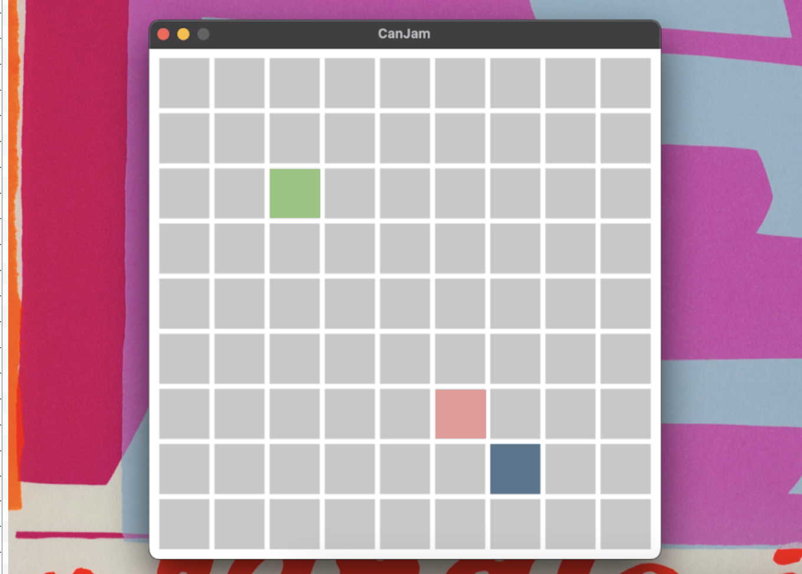

# CanJam

## About

Canjam is a multiplayer Pygame for sharing sounds, and playing on unique synths created using *soundfonts*.

At the start of each game a player will get a randomly generated synth, color, and instrument grid that they will be able to interact with using their mouse.

Each column on the grid corresponds to a key, and each row corresponds to an octave. The grid will display the player's color and play a sound when they click a square.

Once connected to other players, they will be able to see and hear other players' sounds on their grid. Canjam officially support up to 4 players per room, though an arbitrarily large number of players are allowed to join. The current implementation of Canjam experiences poor performance when more than 4 players on in a room playing sounds simultaneously.

## How to play

Once all of the package requirements have been installed, run Canjam with the following:

- Start an instance of Canjam by running `python run.py -n NAME` in the root directory. The program will print out your local IP and the port Canjam is running on.
- Other users on the same Wi-Fi network may join your room using the command `python run.py -n NAME -j HOST:PORT`, where `HOST:PORT` is the IP and port that was printed out by your Canjam instance.
- New players can join a room by connecting to any player that is currently in that room, not just the person who created the room!
- Canjam can be exited by hitting the `ESC` key. Entering `CTRL+C` into the terminal twice will also stop Canjam properly, but it's inelegant.

## Other features

- Canjam operates using a peer-to-peer model, which means that there is no central server managing rooms. When players leave a room, the rest of the players will still be able to stay in the room, and continue to play the game. How exciting!
- Soundfont is a technology that uses a sample based synthesis to play MIDI files, essentially providing the user with fonts or different "instruments" to play MIDI notes with. Future work on this project will include loading in more sound fonts as choices.
- Canjam uses the Fluidsynth library which uses to the synthesizer chip on your computer, so you can interact indirectly with hardware on your very own computer!
