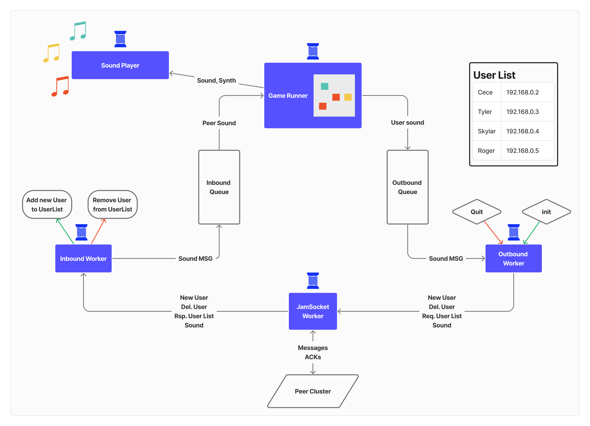
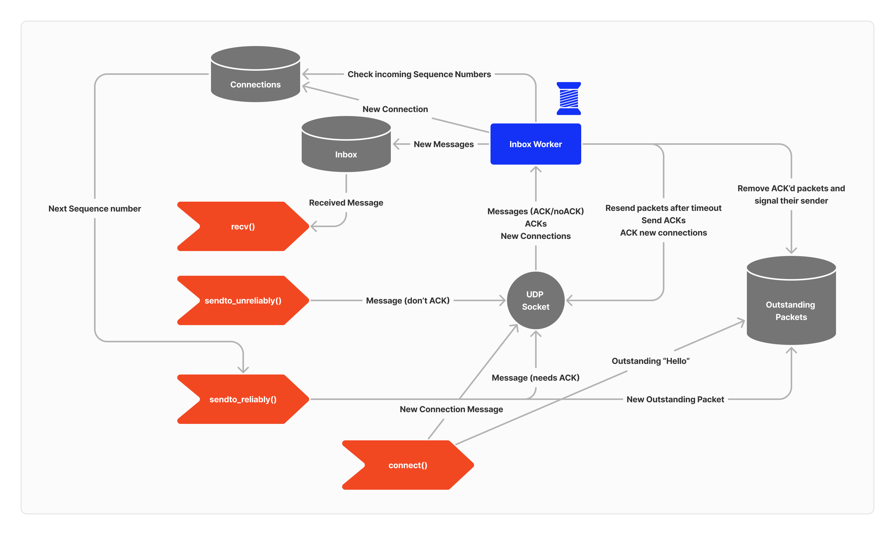

# Project Final Report: CanJam

Roger Burtonpatel, Cece Crumlish, Skylar Gilfeather, Tyler Thompson

## Table of Contents

- [Project Final Report: CanJam](#project-final-report-canjam)
  - [Table of Contents](#table-of-contents)
  - [Project Proposal](#project-proposal)
    - [Minimum Deliverables](#minimum-deliverables)
    - [Maximum Deliverables](#maximum-deliverables)
    - [Foreseeable challenges](#foreseeable-challenges)
    - [First Step](#first-step)
  - [Design](#design)
  - [Outcome Analysis](#outcome-analysis)
  - [Design Reflection](#design-reflection)
    - [CanJam Canvas](#canjam-canvas)
    - [Peer to Peer Model](#peer-to-peer-model)
    - [Pygame Module (Cece and Roger)](#pygame-module-cece-and-roger)
  - [Delegation Reflection](#delegation-reflection)
  - [Bug Report](#bug-report)
  - [Code Overview](#code-overview)
    - [Driver Script](#driver-script)
    - [CanJam Module Design](#the-canjam-modules)
      - [`canjammer`](#canjammer)
      - [`gamerunner`](#gamerunner)
      - [`canjamsynth`](#canjamsynth)
      - [`inboundworker`](#inboundworker)
      - [`outboundworker`](#outboundworker)
      - [`jamsocket`](#jamsocket)
      - [`badsocket`](#badsocket)
      - [`logger`](#logger)
      - [`message`](#message)
      - [`user`](#user)
    - [Unit Tests](#unit-tests)

## Project Proposal

We propose the game **CanJam**.

**CanJam** is a multiplayer melody maker that allows users to play music with each other across multiple laptop instances. We were inspired by the Chrome Music Lab Melody Maker. Our goal with this project is to build a fun, colorful and fun-to-play visual interface, including different musical instruments.

### Minimum Deliverables

1. Basic Sound Modulation and playback via Pyaudio using the Pyfluidsynth library.
2. Tiles that sound varying in pitch, no vertical volume or timbre axis.
3. Single instrument sound type available.
4. Users are assigned a default color and the user's active tile is highlighted with color.
5. Users Play peer sounds as soon as they arrive with no conception of preserving accurate time delay from network delay.
6. Users capable of playing the game with themselves, and connecting to each other's sessions over a Peer-peer server.
7. `<=` 4 users in a single room.

### Maximum Deliverables

1. `>` 4 players in a room.
2. Visual noise animations, like sparkles, or explode on the grid.
3. More modulators added, such as timbre and volume.
4. More instruments loaded in.
5. A globally looping drum track.

### Foreseeable challenges

One of the biggest foreseeable challenges with this project is getting the synths to play nice and work together. As we saw in our initial experiments, playing different synths on the same computer will require some switching between modules and maneuvering handled by the audio driver which may prove to be a limiting factor in the amount of different instruments playing in a single room that we will be able to support at a given time.  

### First Step

Get the music GUI to work: support mouse-over activation of a tiled grid of buttons that each play a note from a particular soundfont loaded onto a synth object by the CanJamSynth module.

This was the logical first step for our project since pygame and playing sounds was the most foreign, mysterious piece of the project. We wanted to make sure it was all possible before proceeding with the rest of the project.

## Minimum Viable Project: Outcome and Analysis

The minimum functionality deliverables for CanJam required that CanJam be able
display unique colors and play unique synth sounds for each user interacting
with the canvas. This goal was achieved, although CanJam only supports four
different synth types, due to performance challenges in generating multiple
`pyfluidsynth` synth object at once. In the future, adapting the synth generation
process to use just one synth objects, or using a different sound generation
library entirely, could eliminate this bottleneck on the number of possible sounds.

Additionally, our minimum functionality deliverables for the larger CanJam
system design required that users be able to spin up a CanJam canvas
independently of any central server. In the CanJam peer-to-peer model, users
manage setup communications and share sound packets with their peers in a 
connected cluster of CanJam users. Our requirements outlined that CanJam
should support multiplayer clusters of minimally two users, and this was
achieved. However, because CanJam peers share sounds by unreliably broadcasting
large batches of small Sound packets, it was difficult to achieve the illusion
of continuously playing sound on the user end. On a user's local canvas,
this resulted in choppy sound and flickering color activation when displaying
a peer's activity on the canvas. However, despite this drawback, our testing
showed that at least six CanJam users could collaboratively play on the same
canvas with no increase in these performance issues when playing a peer's
incoming sounds.

Additional maximum functionality goals for CanJam involved generating animated
"trail" effects for user cursors on the canvas, varying sounds by timbre or
volume on the vertical axis of the grid, and playing a looping drum track
on each user canvas to serve as a metronome. While we were not able to achieve
any of these goals, they are all possible with the current libraries and
CanJam program infrastructure, and could be feasibly implemented with more time.

### System Architecture
The CanJam architecture consists of three primary components, each running on a unique thread: the GameRunner, InboundWorker, and OutboundWorker. These components communicate by producing and consuming Message objects via shared thread-safe queues. These threads are managed by a driving CanJammer component, which maintains a shared UDP socket for the InboundWorker and OutboundWorker.

The **CanJammer** is the driver component that initializes the InboundWorker, GameRunner, and OutboundWorker component threads, which communicate via its shared thread-safe Message queues. If the user is connecting to another CanJam peer, it also performs TSocket setup and initalizes its UserList through a bootstrap "handshake" of ReqUserList, RspUserList, and NewUser Messages with the connected peer. 

The **InboundWorker** is a communication component that receives incoming packets from other CanJam peers on the shared TSocket, and deserializes them into Message objects. It puts incomding Sound Messages on the inQueue for the GameRunner to process and play. And, it handles NewUser and DelUser packets directly by updating the CanJammer's internal UserList.

The **OutboundWorker** is a communication component that serializes Sound Messages into packets, and broadcasts them to all connected Canjam peers on the shared TSocket.

The **GameRunner** is a functional game component that runs the CanJam canvas. It spawns an additional internal sound thread to play synth sounds, while the main thread handles user input and updates the pygame GUI.

The **JamSocket** is a monitor wrapper component for Python’s `socket.socket`. It provides a thread-safe shared UDP socket for sending Messages, with the options to send packets both reliabily and unreliably, handling acknowledgements
and sequence numbers under the hood to maintain unique communication sessions with each peer.

## Design Reflection

### CanJam Canvas
CanJam allows users to play music on a collaborative grid of notes. When clicking and holding, their current cell activates with their color and rings with its note. The barebones canvas GUI, a grid of music tiles, was designed to be intuitively playful and allow for freeform musical experimentation. Barring the latency issues in practice, the visual layout really gives users the convincing experience of playing sounds together on the same canvas.

The original MVP called for a grid with sounds that varied by pitch on the horizontal axis, and by volume on the vertical axis. Although the final MVP only varies notes by pitch, this proved to be a simpler musical interface: users can jump octaves by row, and glide across nodes by column. However, inconsistencies in the sound fonts used to generate synth notes made it difficult to create smooth pitch ranges. Some sound fonts are naturally pitched higher than others; which, in combination with a particularly large grid, result in the highest and lowest tiles generating inaudible pitches.   

Additionally, while the MVP describes users having their own unique color, users may have the same color or synth type, because no central server assigns specific colors and synth types to each user. Furthermore, the `CanJamSynth` module only supports a limited number of synth types, due to performance drawbacks of loading multiple sound font files into memory at once. Having "identical" users in a room isn't necessary a technical problem, although it may confuse other peers on the same canvas. To address this in the future, a user could potentially assign each of its neighboring peers a unique _relative_ color and sound. Or, peer clusters could deny new user requests from a user with a name already in the peer cluster user list.

### Peer to Peer Model
Furthermore, CanJam's peer-to-peer model, which lets users create freeform clusters of peers playing on the same canvas, allows CanJam a great deal of flexibility. While the peer-to-peer design was introduced as a fun pedagogical exercise, it ended up making multiplayer CanJam easy to initiate and resilient to individual failures. No central server is needed to spawn collaborative CanJam canvases, because each user runs their own CanJam instance independently. And, each CanJam user stores its own list of all its connected peers: so, users can spawn large-scale multiplayer canvases whenever they want. And, the peer-to-peer model also preserves CanJam canvases for remaining users when the founding member of the cluster has left. The peer-to-peer model wasn't chosen with the goal of handling expoentnial usership growth; but, on the other hand, it means that any user can create a multiplayer canvas whenever they want. 

### Pygame Module (Cece and Roger)

To be honest this module went through a lot of changes from the initial design. As we began to work more with pygame.

**One thing I feel particularly proud of is:** the inter-game process communication and getting everything to work in terms of updating the board visually with inbound sounds and sending outbound sounds to the correct modules. Additionally, having the game module abstracted from the process of joining a room and talking to other players was really helpful in getting everything to connect seamlessly, once the Peer-Peer portion was completed.

**One thing I wish I would have done differently though was to do more reading up on multiprocessing vs. multithreading:**

Initially I (Cece) thought it would be more beneficial and faster to use multiple processes with pygame as I thought it would allow for actual concurrency with the audio driver. But as it turns out inter-process communication is very slow and all the message passing and note playing on each process I was doing in that version was being hindered by how slow over the network communication was.

**If we had had more time:** I think we would have experimented with different concurrent solutions to the displaying multiple sounds at once problem we had. However we were so spread-thin with getting the pyfluidsynth and pygame to work, that we ran out of time, and didn't get to that part.

## Delegation Reflection

We divided our project between the high-level concurrent monitor & networked
system and the low-level music module. Skylar and Tyler tackled the former; Cece
and Roger tackled the latter. We united our design under a very specific and
unified spec. We all contributed equally to this design, which Roger built
the framework for over break.

This was a very good choice. Skylar and Tyler are very strong in networked
programming, and came up with an excellent peer-to-peer model. The team put a
lot of trust in them to build something that would be compatible with the spec
of the music module when we combined the two, and they did exactly that:
integration was seamless. Cece and Roger built the music module to exactly match
this spec, and were able to tackle challenges on the implementation level while
leaving the interface untouched.

On the individual level, Cece assertively took the lead in building the majority
of the music module. Roger contributed supporting work, including refinements to
design, debugging, library discovery, demo code, and pair programming. Tyler
wrote the TSocket code, and Skylar wrote the Inbound/Outbound workers code and
spearheaded integration. The whole team helped to complete integration, which,
due to our design, was a short process.

Overall, we demonstrated thoughtful and effective division of labor. Each team
member was able to exhibit their own skill set, and unifying our design under a
single spec made integration easy. I would work with this team again in the
future.

## Bug Report

Due to venv and global inconsistencies, getting the `pyfluidsynth` module to
recognize the `fluidsynth` library was very difficult. `fluidsynth` had to be
installed with `brew`, while `pyfluidsynth` was under a local venv or conda
environment. Python locates libraries differently under a venv, so it could not
find `fluidsynth` if we ran the program in one. This manifested in a
compile-time error that was very difficult to debug, because it occurred in
library code we hadn't written.

To find it, we used classic debugging techniques: starting by visually combing
our own codebase, and when that failed, copying the error message into Stack
Overflow. Fortunately, [Stack Overflow](https://stackoverflow.com/questions/62478717/importerrorcouldnt-find-the-fluidsynth-library)
gave a solution, which helped somewhat, but was not a permanent solution because
it was non-portable. We ran into more issues with this, down to architecture and
versioning of the libraries themselves. We finally resolved this by installing a
very careful subset of the packages globally. This was the least-messy way to
get the program to work, although Roger believes it has damaged his python
installation in ways he is not yet aware of.

It is not clear if we could have found this bug faster. We all collaborated to
try to fix it, and only through combined effort did we solve it. The only thing
we can think of as an answer to this question is “type faster.”

## Code Overview

Code for the CanJam project is organized into three main directories:

1. The root directory, which contains the driver script `run.py`
2. The `canjam/` directory, which contains the bulk of the CanJam code
3. The `tests/` directory, which contains a number of unit test files which can be run using the instructions in the [testing](#unit-tests) section

### Driver Script

The CanJam program is started by running `run.py`. It's purpose is to parse command line arguments and pass them off to the rest of the next entrypoint, the CanJammer.

The driver program accepts the following command line arguments:

1. `-n NAME, --name NAME`: The name to use when joining a room. This argument is required and the value should be a string.

2. `-j HOST:PORT, --join HOST:PORT`: Join a room by specifying the address of someone in the room. If not specified, a new empty room will be created. `HOST` must be a reachable IP address of someone in a CanJam room, and `PORT` is the port they're listening on.

3. `-p PORT, --port PORT`: The port to use for internet communication. If not specified, then one will be auto-assigned.

4. `-v, --verbose`: If this flag is present, CanJam will print more information to the console. This argument does not require a value.

### The CanJam Modules

The CanJam Modules are all of the modules contained within the `canjam/` directory. They are used in concert to create the highly concurrent game, CanJam.

#### `canjammer`

The `canjam.canjammer` module provides the `CanJammer` class, which is a multi-threaded manager that oversees communications between the [`InboundWorker`](#inboundworker), [`OutboundWorker`](#outboundworker), and [`GameRunner`](#gamerunner) threads.

Key features of the `CanJammer` class include:

- It accepts command line arguments, such as the name to use when joining a room, the address of a room to join, the port to use for internet communication, and a verbosity flag.
- It initializes the shared server state, such as the list of connected users, and the shared [`JamSocket`](#jamsocket). If specified, it also bootstraps a connection with its first CanJam peer.
- It maintains a queue for inbound and outbound messages, and a set of connected users.

The `CanJammer` class is instantiated and run in the main function of the `run.py` script.

#### `gamerunner`

The `canjam.gamerunner` module provides the `GameRunner` class, which is responsible for running the CanJam game GUI using pygame. Key features of the `GameRunner` class include:

- It provides methods to draw the game grid and set the color of a grid cell.
- It uses a separate thread to handle sound messages from the `in_queue` and play the corresponding note on the [`CanJamSynth`](#canjamsynth) object.
- It maintains a queue for color flashes, which are used to animate the game grid when a note is played.
- It supports different player colors, which are randomly assigned when the `GameRunner` is initialized.

The `GameRunner` class is used by the [`CanJammer`](#canjammer) class to run the game GUI and handle sound messages from the `in_queue`.

#### `canjamsynth`

The `canjam.canjamsynth` module provides the `CanJamSynth` class, which is responsible for generating and playing sound data for the CanJam game. It uses the `numpy`, `pyaudio`, and `fluidsynth` libraries to generate and play sounds. It provides a method to play a note, which generates the sound, plays it, and then stops the note. Multiple sound fonts are supported, which can be selected when creating an instance of the class.

The `CanJamSynth` class is used by the [`GameRunner`](#gamerunner) class to generate sound based on the game state.

#### `inboundworker`

The `canjam.inboundworker` module provides the `InboundWorker` class, a multi-threaded worker that listens for incoming messages on a [`Jamsocket`](#jamsocket) and processes them. [`Sound` messages](#message) are ferried to the `in_queue` to be consumed by a [`GameRunner`](#gamerunner), while all other messages are handled immediately by the worker, often mutating or sharing the user list with others.

#### `outboundworker`

The `canjam.outboundworker` module provides the `OutboundWorker` class, a multi-threaded worker that sends outgoing messages through a [`Jamsocket`](#jamsocket). It's quite a simple worker that sends [`Sound` messages](#message) unreliably and all other messages reliably.

#### `jamsocket`

The `canjam.jamsocket` module provides the `Jamsocket` class, a socket wrapper that provides both reliable and unreliable UDP communication methods.

Key features of the `Jamsocket` class include:

- It uses the [`socket`](https://docs.python.org/3/library/socket.html) library to create and manage a UDP socket.
- It provides methods to send and receive data, with optional reliability.
- It uses a separate thread that listens for incoming packets and handles timeouts for outstanding packets.
- It uses different types of packets, including `Ack`, `Data`, `DataNoAck`, `Skip`, `Die`, `Hello`, and `HelloAck` to send data and maintain connections with other `Jamsocket`s.

The `Jamsocket` class is used by the [`InboundWorker`](#inboundworker) and [`OutboundWorker`](#outboundworker) classes to send and receive messages over the network. `Sound` messages are sent unreliably to achieve low-latency, while all other messages are sent reliably to ensure a consistent room state.

Please note, that the packet types defined in the `jamsocket` module are *not* the same as the [`message`](#message) types described below. The `jamsocket` packets are used internally by `jamsocket` to choreograph reliable message sending, while [`Message`](#message) objects are used by the [`InboundWorker`](#inboundworker), [`OutboundWorker`](#outboundworker), and [`GameRunner`](#gamerunner) to exchange user lists and sounds.

#### `badsocket`

The `canjam.badsocket` module provides a `badsocket` class that simulates a UDP socket with random network failures. It is a subclass of Python's built-in [`socket`](https://docs.python.org/3/library/socket.html) class and overrides some of its methods to introduce random failures. To prevent it from being used in a context that requires reliability, any attempts to use TCP-related methods like `connect`, `send`, `listen`, and `accept` will raise a `NotImplementedError`. It simulates random network failures in the `sendto` method. Sometimes it fails to send the packet, and other times it sends out withheld packets (to simulate duplicated packets).

#### `logger`

The `canjam.logger` module is a tiny module that allows a client to set verbosity, then use `vprint` to print messages only when verbose it set to true. `vprint` is used throughout CanJam to print out helpful debug messages when the game is run with the verbose (`-v`) flag.

#### `message`

The `canjam.message` module provides various classes representing different types of messages that can be sent over the network in the CanJam game. Each message type uses the [`dataclass`](https://docs.python.org/3/library/dataclasses.html) decorator which automatically generates a constructor that takes each field as arguments. Conveniently, each message class inherits from the `Message` class, which exists to provide `serialize` and `deserialize` methods. They use the [`pickle`](https://docs.python.org/3/library/pickle.html) module to convert to and from `bytes` representations of the messages. We probably could have designed smaller serialized representations of our messages, but [`pickle`](https://docs.python.org/3/library/pickle.html) is far more robust, so we deemed it worth the performance hit. Perhaps in a future version of CanJam it could serialize into a smaller custom scheme.

The `message` module is used by the [`InboundWorker`](#inboundworker), [`OutboundWorker`](#outboundworker), and [`CanJammer`](#canjammer) classes to send and receive CanJam-specific messages over the network.

#### `user`

The `canjam.user` module provides the `User` class, a data class representing a user in the CanJam game using their name and address. It's a tiny class that can serialize and deserialize instances of itself using [`pickle`](https://docs.python.org/3/library/pickle.html). Interestingly, it defines `__hash__` and `__eq__` implementation so it can be stored in a `set`, which is how the `user_set` is implemented.

### Unit Tests

The `tests/` directory is a collection of scripts containing unit tests for various CanJam modules. As modules were implemented or their functionality changed, these tests were updates and run to ensure consistent behavior. Each test file is described below.

1. `test_canjamsynth.py` tests that the [`CanJamSynth`](#canjamsynth) module from `canjam/canjamsynth.py`. It ensures that a [`CanJamSynth`](#canjamsynth) object can be instantiated and used to play a note using a particular Fluidsynth synth type. Since it's very difficult to verify that the note was actually played, this test really just ensures that the constructor and `play_note` method don't crash.

2. `test_inboundworker.py` tests the [`InboundWorker`](#inboundworker) module from `canjam/inboundworker.py`. It verifies that it functions correctly when receiving each type of message that is sent during CanJam operation. It ensures that the user list is mutated correctly and sounds are ferried to the `in_queue`. It also ensures that malformed messages are disregarded and do not crash the `InboundWorker.

3. `test_outboundworker.py` tests the [`OutboundWorker`](#outboundworker) module from `canjam/outboundworker.py`. It verifies that messages are correctly formatted and sent to the appropriate destination. It also checks that the [`OutboundWorker`](#outboundworker) handles errors gracefully without crashing. The tests cover different types of messages including sound, user list requests, user list responses, new user, and user deletion.

4. `test_user.py` tests the [`User`](#user) module from `canjam/user.py`. It ensures that user objects can be correctly created and serialized. It also checks that the module correctly handles various edge cases, such as malformed user data.

5. `test_message.py` tests the [`Message`](#message) module from `canjam/message.py`. It ensures that messages are correctly created, serialized, and deserialized. It also checks that the module correctly handles various edge cases, such as malformed messages.

6. `test_sockets.py` tests the [`Jamsocket`](#jamsocket) module. It constructs [`jamsocket`](#jamsocket)s using [`badsocket`](#badsocket) instances in order to simulate a terribly unreliable network, then sends many messages through the socket. There are even tests that spin up a bunch of threads to test the [`jamsocket`](#jamsocket)'s thread-safety! This is probably the most robust test file since it's absolutely imperative that the [`Jamsocket`](#jamsocket) functions well, otherwise many of the other mechanisms in other modules are not guaranteed.
